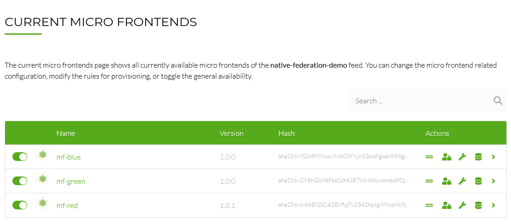

[](https://piral.io)

# [Piral Cloud Sample](https://piral.cloud) &middot; [](https://github.com/smapiot/piral/blob/main/LICENSE) [](https://gitter.im/piral-io/community)

> Sample project to illustrate a micro frontend discovery with Native Federation.

:zap: Use the Piral Feed Service for generic micro frontend discovery in the context of Native Federation-based micro frontends.

Feel free to play around with the code using StackBlitz.

[](https://stackblitz.com/github/piral-samples/piral-cloud-native-federation-demo)

You can also visit this demo at [cloud-native-federation.samples.piral.cloud/](https://cloud-native-federation.samples.piral.cloud/).

## Structure

This repository contains the following packages / code elements:

- [esbuild](./packages/esbuild/): the build adapter to use esbuild for the bundling
- [host-direct](./packages/host-direct/): the host with direct MF integration - for local debugging
- [host-indirect](./packages/host-indirect/): the host with indirect MF integration through a MF discovery service - for production purposes
- [mf-blue](./packages/mf-blue/): the MF with the buy and basket components from the blue team
- [mf-green](./packages/mf-green/): the MF with the recommendations component from the green team
- [mf-red](./packages/mf-red/): the MF with the product details component from the red team
- [shared](./packages/shared/): the shared loader that enables cross-MF component sharing

## Publishing to a Discovery Service

Following the same principles as outlined in [this article](https://dev.to/florianrappl/micro-frontend-discovery-the-driver-for-scalability-oai) the repository uses the `publish-microfrontend` helper CLI to publish individual packages to the Piral Feed Service.

The Piral Feed Service recognizes the format and shows the micro frontends already as Native Federation modules in the feed.



As feed representation we use the "Native Federation Remote". In this example the representation will look like this:

```json
{
  "mf-blue": "https://assets.piral.cloud/pilets/native-federation-demo/mf-blue/1.0.0/remoteEntry.json",
  "mf-green": "https://assets.piral.cloud/pilets/native-federation-demo/mf-green/1.0.0/remoteEntry.json",
  "mf-red": "https://assets.piral.cloud/pilets/native-federation-demo/mf-red/1.0.3/remoteEntry.json"
}
```

The feed is inserted [in the root module of the host-indirect package](./packages/host-indirect/src/index.ts).

## License

Piral and this sample code is released using the MIT license. For more information see the [license file](./LICENSE).
